<p align="center">
  
</p>

<h1 align="center">SkillSeed</h1>

<p align="center">
  <strong>The npm for AI agent skills.</strong><br/>
  Plant a skill, watch it grow, seed the network.
</p>

<p align="center">
  <a href="https://github.com/carvalhxlucas/skill-seed/stargazers"></a>
  <a href="https://github.com/carvalhxlucas/skill-seed/blob/main/LICENSE"></a>
  <a href="https://skillseed.dev/docs"></a>
  
</p>

---

## What is SkillSeed?

Today, when you want your AI agent to do something specific — query SQL, scrape the web, review code — you write the system prompt from scratch, test it, iterate, and hope it works.

**SkillSeed is a network where agents teach other agents.**

Specialist agents (*seeders*) share validated, benchmarked skills. Your agent (*grower*) learns from them in minutes. And the network gets smarter over time — seeders autonomously revise their curriculum based on what growers fail at.

```python
from skillseed import SkillSeed

ss = SkillSeed(api_key="sk-...")
agent = ss.enroll(name="my-assistant", framework="langchain")

session = agent.learn("sql-expert")
print(session.status)        # "bloomed"
print(session.learned_state) # {"system_prompt_delta": "You are an expert in SQL..."}
```

---

## How it works

```
Seeder (SQL Expert) ──teaches──▶ Grower ──eval──▶ Bloomed skill ✓
                                           ↑
                              FeedbackSignal sent back to seeder
                                           ↓
                              Seeder revises curriculum autonomously
```

**Three roles in the network:**

| Role | Can learn? | Can teach? | Requirement |
|---|---|---|---|
| Grower | ✅ | ❌ | Just enroll |
| Seeder | ✅ | ✅ | Contribute a skill |
| Root Seeder | ✅ | ✅ | Curated by SkillSeed |

**How learning happens:**

1. Your agent receives the skill curriculum from a seeder
2. The **Prompt Distillation Protocol** generates an expert system prompt from the curriculum
3. An automated eval benchmarks the result
4. A **shadow eval** (tasks never shown to the seeder) validates integrity — preventing teaching-to-the-test
5. If eval score ≥ threshold → skill is marked **bloomed** on your agent
6. A `FeedbackSignal` is sent back to the seeder (public score only — shadow results stay private)
7. If the seeder's bloom rate drops, it **autonomously revises its curriculum**

---

## Self-improving seeders

What makes SkillSeed different from a static prompt library: **seeders get better over time without manual intervention.**

```
Session 1: grower fails "CTE optimization" → FeedbackSignal created
Session 2: grower fails "CTE optimization" → FeedbackSignal created
Session 5: bloom rate drops below threshold
           → SeederEvolution analyzes failure patterns
           → Identifies "CTE optimization" as weak spot
           → Generates revised curriculum (v1.1.0)
           → Future growers learn from the improved curriculum
```

Curriculum revisions are versioned — every change is tracked, never mutated in place, and can be rolled back.

---

## Shadow eval — anti-gaming protection

Every skill has two eval sets:

- **Public eval tasks** — shared with seeders via `FeedbackSignal` so they can improve
- **Shadow eval tasks** — never exposed to seeders under any circumstance

If a seeder's shadow score lags significantly behind its public score, it gets flagged for review. This prevents a seeder from gaming the system by teaching directly to the public test questions.

---

## Use it in Claude Code

```bash
claude mcp add skill-seed
```

Then declare what your agent should know in `SKILL_SEED.md`:

```yaml
# SKILL_SEED.md
skills:
  - sql-expert
  - web-scraper
  - code-reviewer
```

Claude Code reads this file on startup and auto-triggers a learning session for each declared skill. No manual setup.

---

## Use it via SDK

```bash
pip install skillseed
```

> Package not yet published. Follow the repo for updates.

```python
from skillseed import SkillSeed

ss = SkillSeed(api_key="sk-...")

# enroll your agent
agent = ss.enroll(name="my-assistant", framework="langchain")

# learn a skill — blocks until bloomed or failed
session = agent.learn("sql-expert")
print(session.status)         # "bloomed"
print(session.eval_score)     # 0.85

# list available skills
skills = ss.registry.search("data")

# contribute a skill (become a seeder)
ss.seed(agent_id=agent.id, skill=my_skill_definition)
```

---

## Use it via REST API

```http
POST /v1/agents/enroll
GET  /v1/agents/{id}/skills

GET  /v1/skills/registry?category=data&search=sql
POST /v1/skills/learn
GET  /v1/skills/learn/{session_id}
POST /v1/skills/reload

POST /v1/skills/seed

GET  /v1/seeders/{id}/feedback
GET  /v1/seeders/{id}/curriculum/history
POST /v1/seeders/{id}/evolve
```

Works with any language, any framework — LangChain, LangGraph, CrewAI, AutoGen, custom.

All endpoints require `X-API-Key` authentication. The `/v1/skills/reload` and `/v1/seeders/{id}/evolve` endpoints require `X-Admin-Key`.

---

## Skill Registry

| Skill | Category | Seeder | Status |
|---|---|---|---|
| `sql-expert` | data | @root | 🌱 in development |
| `web-scraper` | automation | @root | 🌱 in development |
| `code-reviewer` | engineering | @root | 🌱 in development |

Adding a new skill is as simple as dropping a YAML file in `seeders/`:

```yaml
# seeders/my-skill.yaml
id: my-skill
name: My Skill
version: 1.0.0
category: data
description: >
  What this skill teaches.
curriculum:
  - "Task 1 the seeder uses to teach"
  - "Task 2 the seeder uses to teach"
eval_tasks:
  - task: "What the grower must demonstrate"
    expected_concepts: ["concept A", "concept B"]
shadow_eval_tasks:
  - task: "Hidden eval — never shown to seeders"
    expected_concepts: ["concept C"]
evolution:
  enabled: true
  revision_threshold: 0.6
  min_signals_to_revise: 5
```

Then hit `POST /v1/skills/reload` — no restart needed.

---

## Running locally

```bash
git clone https://github.com/skill-seed/skill-seed
cd skill-seed

cp .env.example .env  # fill in your values

# start postgres + redis
docker-compose up -d postgres redis

# install packages
pip install -e packages/core packages/api packages/sdk-python packages/mcp-server

# run the API
uvicorn packages.api.main:app --reload --port 8000

# run tests
make test
```

---

## Project structure

```
skill-seed/
├── packages/
│   ├── core/          # models, protocol, registry, evaluators, evolution
│   ├── api/           # FastAPI REST API
│   ├── sdk-python/    # Python SDK
│   └── mcp-server/    # MCP server for Claude Code
├── seeders/           # Root Seeder YAML definitions
├── docker-compose.yml
└── Makefile
```

---

## Roadmap

- [x] Core skill transfer protocol (Prompt Distillation)
- [x] REST API (FastAPI)
- [x] Python SDK
- [x] MCP Server (Claude Code integration)
- [x] YAML-driven skill registry (hot-reload)
- [x] Seeder self-improvement loop (Level 1 — reactive)
- [x] Failure pattern analysis (Level 2 — proactive)
- [x] Shadow eval integrity protection
- [x] Curriculum versioning
- [ ] LLM integration for real prompt distillation (OpenAI / Claude)
- [ ] PostgreSQL + Redis persistence (replace in-memory)
- [ ] Public skill registry at skillseed.dev
- [ ] Certified seeder program
- [ ] Cross-seeder learning (Level 3)
- [ ] JS/TS SDK

---

## Contributing

SkillSeed is open-source and community-driven. Every skill in the network is a contribution.

See [CONTRIBUTING.md](./CONTRIBUTING.md) for how to propose new skills, improve the transfer protocol, or build SDKs for other languages.

---

## Why open-source?

Because the network is only as strong as its community.

The more seeders contribute skills, the more valuable the network becomes for every grower. That only works if the protocol is open, auditable, and extensible by anyone.

---

## License

MIT © [SkillSeed](https://github.com/skill-seed)

---

<p align="center">
  <sub>Built for the AI agent ecosystem. Inspired by npm, PyPI, and the belief that agents should learn from each other.</sub>
</p>
